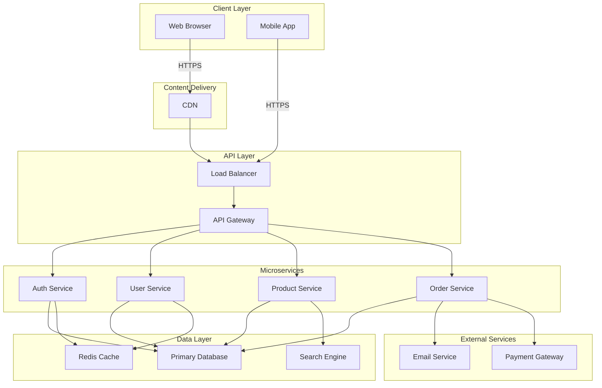

# Architecture Overview

## System Architecture Diagram

## Components

### Client Layer
- **Web Browser**: Desktop and tablet web application
- **Mobile App**: Native or cross-platform mobile application

### Content Delivery
- **CDN**: Caches static assets (images, CSS, JavaScript) globally for faster delivery

### API Layer
- **Load Balancer**: Distributes incoming requests across API Gateway instances
- **API Gateway**: Routes requests to appropriate microservices, handles authentication

### Microservices
- **Auth Service**: Manages user authentication and authorization
- **User Service**: Handles user profiles and account management
- **Product Service**: Manages product catalog and inventory
- **Order Service**: Processes orders and transactions

### Data Layer
- **Primary Database**: Main data store for all services
- **Redis Cache**: In-memory cache for frequently accessed data
- **Search Engine**: Optimized search and indexing (e.g., Elasticsearch)

### External Services
- **Email Service**: Handles transactional emails
- **Payment Gateway**: Processes payments securely

## Data Flow

1. Client requests flow through the CDN for static assets or through the Load Balancer for API requests
2. API Gateway routes requests to appropriate microservices
3. Services query the database or cache layer
4. Services can call external APIs (email, payments) as needed
5. Responses are returned to clients

## Key Design Principles

- **Scalability**: Microservices can be scaled independently
- **High Availability**: Load balancing and CDN ensure redundancy
- **Performance**: Caching layer reduces database load
- **Security**: API Gateway handles authentication and authorization
